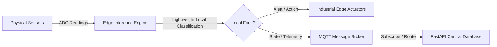

# Edge AI Report

## Executive Summary
This report summarizes the design, configuration, and simulation of Edge AI nodes for the NexTwin AI ecosystem. We created fully realized C++ (ESP32) and Python (Raspberry Pi) edge inference nodes that perform physical telemetry threshold classification locally before transmitting logs back to the central backend.

## Edge Nodes Architecture
Industrial IoT edge architectures run sensor data streams through a local rules engine to reduce centralized processing requirements and network bandwidth.

## Node Implementations

### 1. Raspberry Pi Gateway Node
- **File**: [edge_inference.py](file:///d:/NexTwinAI/edge-device/raspberry-pi/edge_inference.py)
- **Engine**: Python-based event loop sampling simulated temperature, noise, pressure, and vibration sensors every 2 seconds.
- **Local Inference**: Heuristically calculates failure probabilities and maps priority levels (`Low`, `Medium`, `High`, `Critical`).
- **Telemetry Transmission**: Demonstrates a **double-transport payload** publishing logs to `factory/shopfloor/M_001/state` via simulated MQTT, and synchronizes logs directly to the central database via `POST /api/v1/predict/health` REST endpoints.

### 2. ESP32 Microcontroller Node
- **File**: [esp32_edge.ino](file:///d:/NexTwinAI/edge-device/esp32/esp32_edge.ino)
- **Engine**: Arduino C++ firmware loop sampling analog pins (ADC) to read acoustic noise, pneumatic pressure, vibration amplitudes, and thermal variables.
- **Local Heuristic**: Runs instant boundary limit checks. Raises a hardware alarm state (`edge_alarm = true`) if vibration exceeds 4.5 mm/s, temperature exceeds 85.0 C, or pressure exceeds 6.2 bar.
- **Transmission**: Operates a secure TCP stack connecting to the local factory broker via the `PubSubClient` MQTT library. Falls back to a local buffer when Wi-Fi connection drops.
