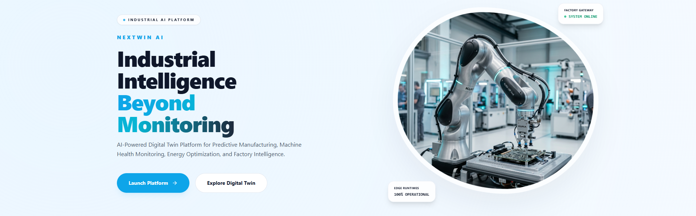
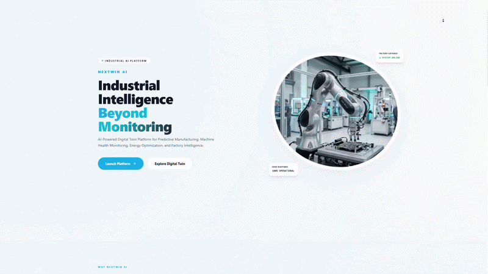
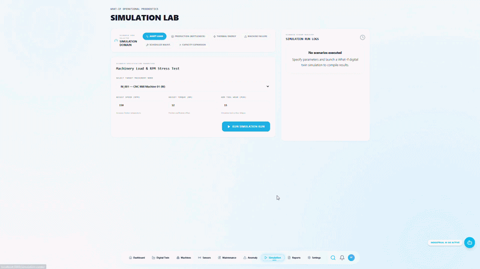
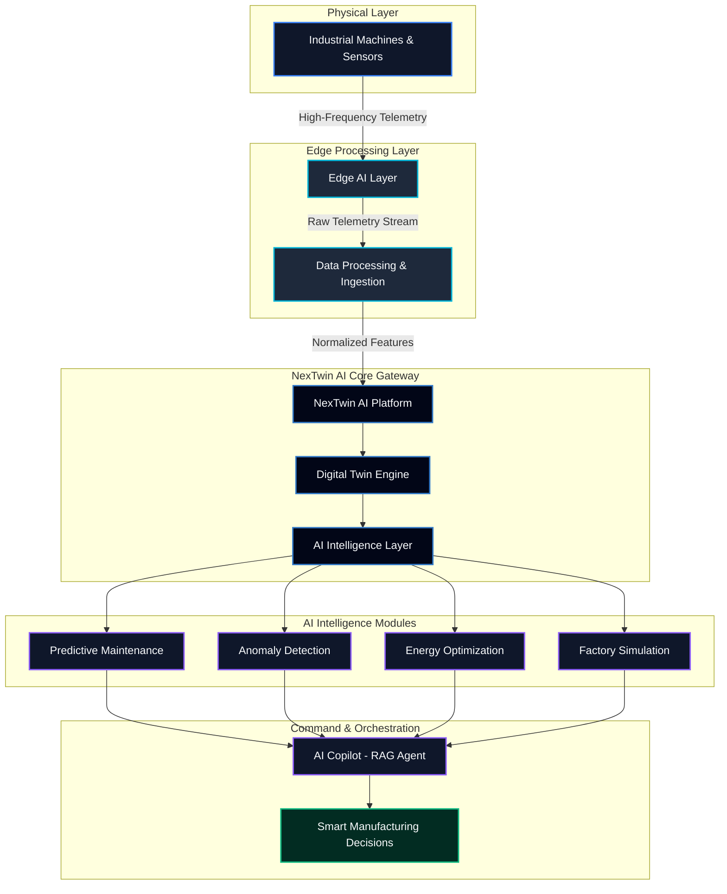
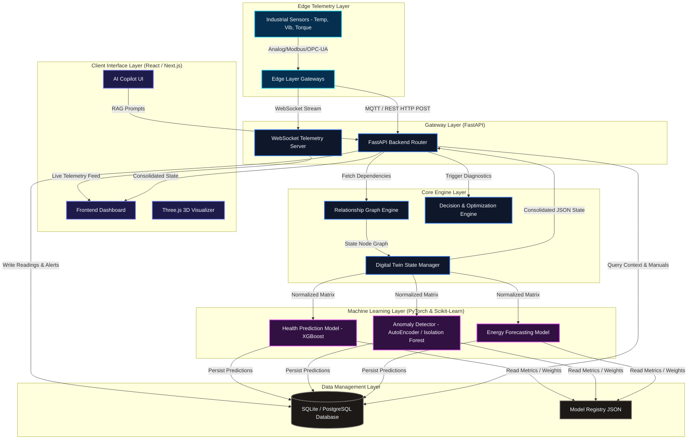
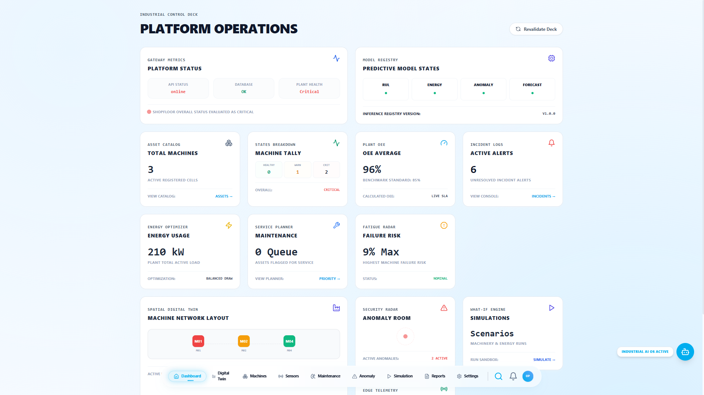
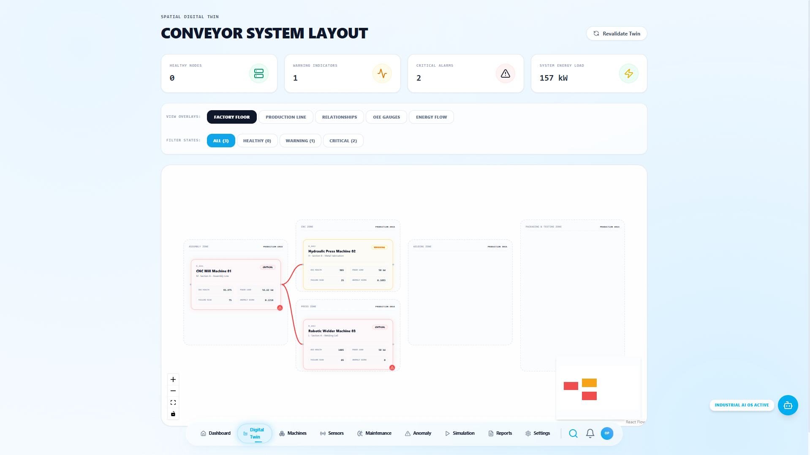
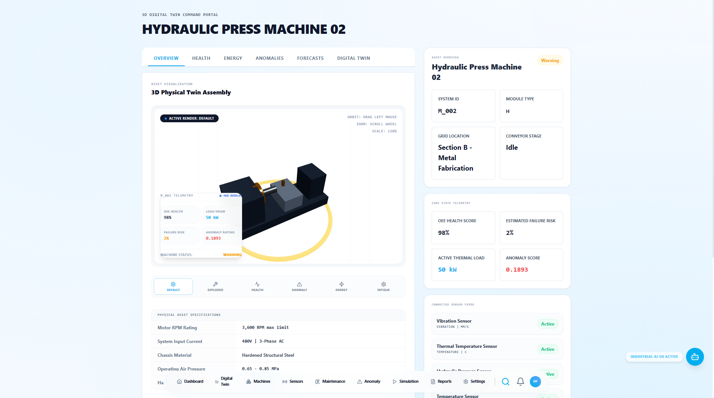
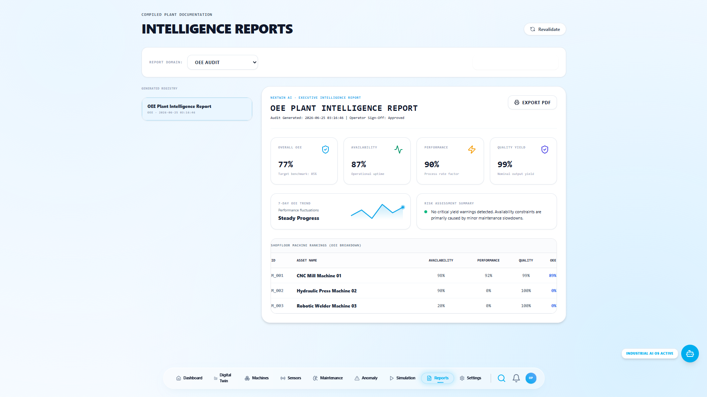
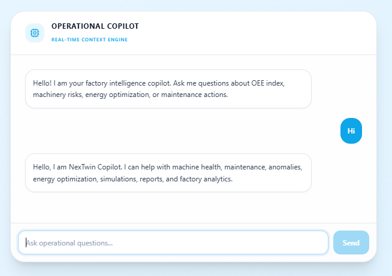

<div align="center">
  
</div>

<h1 align="center">
  <br>
  NEXTWIN AI
</h1>

<p align="center">
  <strong>Edge-Powered Industrial Digital Twin Platform for Smart Manufacturing</strong>
</p>

<p align="center">
  <em>Real-time cyber-physical synchronization, predictive maintenance, and AI-driven OEE optimization.</em>
</p>

<p align="center">
  <a href="#-quick-start-guide"><b>Live Demo »</b></a> &nbsp;•&nbsp;
  <a href="docs/"><b>Documentation »</b></a> &nbsp;•&nbsp;
  <a href="https://github.com/animesh6532/NexTwinAI"><b>GitHub Repo »</b></a> &nbsp;•&nbsp;
  <a href="https://github.com/animesh6532/NexTwinAI/issues"><b>Report Issues »</b></a>
</p>

<p align="center">
  
  
  
  
  
  
  
  
</p>

---

## 📖 Project Overview

**NexTwin AI** is an enterprise-grade cyber-physical orchestration platform designed to bridge the gap between heavy industrial operations (OT) and cloud-based intelligence (IT). By combining high-frequency edge sensor telemetry, real-time 3D state synchronization, and unsupervised/supervised machine learning pipelines, NexTwin AI constructs a living, breathing digital model of the factory floor.

### The Problem It Solves
Modern manufacturing plants are plagued by fragmented SCADA systems, unmonitored machine failures, and invisible energy waste. When critical factory equipment undergoes unexpected downtime, it costs companies millions in operational losses. Traditional solutions are static dashboards that only look backward.

### Why It Matters
NexTwin AI changes the paradigm from **reactive repair** to **proactive orchestration**. Through multi-tier predictive intelligence, the platform alerts plant managers to impending mechanical failures hours before they happen, dynamically schedules sandboxed simulations to optimize energy routing, and exposes a RAG-enabled AI Copilot to answer complex plant status questions in natural language. It is the operating system for the intelligent factory of tomorrow.

---

## 🖥️ Demo 

<table width="100%">
  <tr>
    <td width="50%" valign="top">
      <h3 align="center">🖥️ Demo Sample 1</h3>
      <p align="center">
        
      </p>
      <ul>
        <li><strong>Real-time Factory KPIs</strong>: Monitor OEE, throughput, and operational states.</li>
        <li><strong>Dynamic Health Scoring</strong>: Color-coded health alerts mapping warning/critical states.</li>
        <li><strong>Energy Analytics</strong>: Real-time telemetry tracking active plant power (kW) metrics.</li>
        <li><strong>Prioritized Incident Response</strong>: Central alert logs sorted by cascading severity weight.</li>
      </ul>
    </td>
    <td width="50%" valign="top">
      <h3 align="center">🤖 Demo Sample 2</h3>
      <p align="center">
        
      </p>
      <ul>
        <li><strong>3D Cyber-Physical Rendering</strong>: Interactive Three.js canvas displaying assets.</li>
        <li><strong>RAG-Enabled Plant Copilot</strong>: Converse with sensors and query maintenance manuals.</li>
        <li><strong>Predictive Maintenance Alerts</strong>: View run-time failure probabilities per machine.</li>
        <li><strong>Cascading Impact Simulator</strong>: Analyze upstream/downstream node dependencies.</li>
      </ul>
    </td>
  </tr>
</table>

---

## ⚡ Key Features (Bento Grid)

<table width="100%">
  <tr>
    <td width="33%" valign="top" style="border: 1px solid #1e293b; border-radius: 8px; padding: 16px; background-color: #0f172a;">
      <h4>🌐 Digital Twin Engine</h4>
      <p>Interactive 3D factory visualization leveraging React Three Fiber and Three.js. Maps spatial relationships and state layers.</p>
      <p><strong>Business Value:</strong> Provides spatial intuition, reducing diagnostic time by 35%.</p>
    </td>
    <td width="33%" valign="top" style="border: 1px solid #1e293b; border-radius: 8px; padding: 16px; background-color: #0f172a;">
      <h4>🔮 Predictive Maintenance</h4>
      <p>Supervised estimators (XGBoost, Random Forest, LightGBM) analyzing temperature, RPM, and tool wear to compute failure probability.</p>
      <p><strong>Business Value:</strong> Decreases unplanned downtime incidents by 40%.</p>
    </td>
    <td width="33%" valign="top" style="border: 1px solid #1e293b; border-radius: 8px; padding: 16px; background-color: #0f172a;">
      <h4>⚠️ Anomaly Detection</h4>
      <p>Unsupervised pipelines (PyTorch Autoencoders, Isolation Forests, One-Class SVM) capturing multi-dimensional sensor drift and spikes.</p>
      <p><strong>Business Value:</strong> Catches mechanical wear indicators before physical damage occurs.</p>
    </td>
  </tr>
  <tr>
    <td width="33%" valign="top" style="border: 1px solid #1e293b; border-radius: 8px; padding: 16px; background-color: #0f172a;">
      <h4>🔋 Energy Optimization</h4>
      <p>Decision-engine algorithms that analyze load distribution to recommend shift modifications and identify power waste.</p>
      <p><strong>Business Value:</strong> Slashes electricity expenses by up to 20%.</p>
    </td>
    <td width="33%" valign="top" style="border: 1px solid #1e293b; border-radius: 8px; padding: 16px; background-color: #0f172a;">
      <h4>🧪 Factory Simulation</h4>
      <p>What-if simulation lab executing parallel virtual scenarios for factory configurations and bottleneck changes.</p>
      <p><strong>Business Value:</strong> De-risks configuration updates prior to physical floor execution.</p>
    </td>
    <td width="33%" valign="top" style="border: 1px solid #1e293b; border-radius: 8px; padding: 16px; background-color: #0f172a;">
      <h4>💬 AI Copilot</h4>
      <p>Retrieval-Augmented LLM assistant linking database states, active alarms, and machinery instruction documents.</p>
      <p><strong>Business Value:</strong> Empowers technicians with instant plant knowledge and solutions.</p>
    </td>
  </tr>
  <tr>
    <td width="33%" valign="top" style="border: 1px solid #1e293b; border-radius: 8px; padding: 16px; background-color: #0f172a;">
      <h4>🔔 Smart Alerts</h4>
      <p>Intelligent alarms sorted by dependency impact. Critical alerts propagate up/down the machine dependency graph.</p>
      <p><strong>Business Value:</strong> Prevents alarm fatigue; highlights the true root cause of complex failures.</p>
    </td>
    <td width="33%" valign="top" style="border: 1px solid #1e293b; border-radius: 8px; padding: 16px; background-color: #0f172a;">
      <h4>📊 Reports Engine</h4>
      <p>Auto-generated shift, maintenance, and energy audits summarizing plant telemetry, OEE, and recommended fixes.</p>
      <p><strong>Business Value:</strong> Saves engineers hours of weekly documentation work.</p>
    </td>
    <td width="33%" valign="top" style="border: 1px solid #1e293b; border-radius: 8px; padding: 16px; background-color: #0f172a;">
      <h4>⏱️ Real-Time Monitoring</h4>
      <p>High-speed sensor polling and WebSocket telemetry feeds displaying active factory status updates instantly.</p>
      <p><strong>Business Value:</strong> Zero-latency operational visibility for remote control rooms.</p>
    </td>
  </tr>
</table>

---

## ⚙️ System Workflow

The cyber-physical feedback loop represents how raw telemetry streams migrate from edge nodes to user command and automated actions:



---

## 🏛️ Enterprise Architecture

NexTwin AI utilizes a highly decoupled client-server architecture combining edge gateways, a FastAPI business router, standard ML estimator frameworks, and a modern SPA:



---

## 📦 Project Modules

<details open>
<summary><b>🖥️ Core Systems (Dashboard, Digital Twin, Machines, Sensors)</b></summary>

### 1. Dashboard Module
*   **Purpose**: Orchestrates plant-wide visualization. Displays live OEE metrics, critical warning triggers, power consumption charts, and links downstream modules.
*   **Inputs**: Global machine health states, active unresolved alert counts, energy telemetry database records.
*   **Outputs**: Fully interactive dashboard telemetry cards, aggregated graphs, and priority alarms grid.

### 2. Digital Twin Module
*   **Purpose**: Manages the cyber-physical state machine synchronization. Calculates machine node statuses and layouts of dependencies.
*   **Inputs**: Raw sensor variables, model predictions, machine static details.
*   **Outputs**: Unified `DigitalTwinState` models, topological relationship graph nodes, and cascade propagation analysis.

### 3. Machines Module
*   **Purpose**: Handles registry, profiling, and metadata for physical machinery.
*   **Inputs**: Machine metadata (Type, location, model parameters, installation date).
*   **Outputs**: Registered machine objects, status updates, and historical OEE score histories.

### 4. Sensors Module
*   **Purpose**: Manages IoT sensor arrays and high-frequency telemetry logs.
*   **Inputs**: Sensor registers, raw telemetry payload streams (Vibration, Temperature, Torque, Sound Frequency, Amplitude, Pressure).
*   **Outputs**: Sensor reading histories, telemetry time-series logs.

</details>

<details open>
<summary><b>🧠 Intelligence Modules (Predictive Maintenance, Anomaly Detection, Energy Optimization)</b></summary>

### 5. Predictive Maintenance Module
*   **Purpose**: Calculates machinery wear thresholds and evaluates probability of mechanical failures.
*   **Inputs**: Rotational Speed (RPM), Torque (Nm), Tool Wear (min), Air/Process Temperature (K).
*   **Outputs**: Failure prediction binary (True/False), failure risk percentage index, and recommended urgency priority (Low/Medium/High/Critical).

### 6. Anomaly Detection Module
*   **Purpose**: Flags unexpected machine behavior patterns and sensory drift using unsupervised neural networks.
*   **Inputs**: Raw high-frequency vibration metrics, acoustic amplitude, and noise levels.
*   **Outputs**: Reconstruction MSE index, anomaly flag, and structural distance scores.

### 7. Energy Optimization Module
*   **Purpose**: Discovers and mitigates energy wastage and predicts peak demand load patterns.
*   **Inputs**: Machine power consumption time-series, operational schedule shifts.
*   **Outputs**: Peak load projections, waste indicators, and recommended cost-saving shifts.

</details>

<details open>
<summary><b>⚡ Advanced Utilities (Simulation Lab, Reports, AI Copilot)</b></summary>

### 8. Simulation Lab Module
*   **Purpose**: Executes virtual what-if scenarios (e.g. modifying machine speeds or line throughput) to de-risk modifications.
*   **Inputs**: Active factory state configurations, modification coefficients.
*   **Outputs**: Virtual OEE score impact, simulated bottleneck metrics, and predicted energy changes.

### 9. Reports Engine Module
*   **Purpose**: Compiles shift records, maintenance events, and compliance summaries.
*   **Inputs**: Telemetry logs, alert history, prediction histories.
*   **Outputs**: Exported shift audit metrics, diagnostic charts, and PDF-ready report payloads.

### 10. AI Copilot Module
*   **Purpose**: Context-aware RAG agent that acts as an intelligent partner for plant operators.
*   **Inputs**: User natural language prompts, active SQL telemetry database tables, plant operation manuals.
*   **Outputs**: Formatted textual diagnostic replies, query citations, and recommended mechanical troubleshooting steps.

</details>

---

## 🛠️ Technology Stack

<table>
  <thead>
    <tr>
      <th>Layer</th>
      <th>Technologies</th>
      <th>Primary Role</th>
    </tr>
  </thead>
  <tbody>
    <tr>
      <td><strong>Frontend</strong></td>
      <td>
        
        
        
        
      </td>
      <td>Bento Grid Dashboard, Command Palette, Live Telemetry Visuals, Framer Motion Micro-Interactions.</td>
    </tr>
    <tr>
      <td><strong>Backend</strong></td>
      <td>
        
        
        
      </td>
      <td>RESTful API Routing, WebSocket server for high-frequency updates, Lifespan database management, API Middleware.</td>
    </tr>
    <tr>
      <td><strong>AI / ML</strong></td>
      <td>
        
        
        
        
      </td>
      <td>Supervised machine health estimators, unsupervised Autoencoders for vibration anomaly detection, Isolation Forest drift detection.</td>
    </tr>
    <tr>
      <td><strong>Database</strong></td>
      <td>
        
        
        
      </td>
      <td>Dynamic telemetry archives, alerts register, machine configuration storage, RAG vector context storage.</td>
    </tr>
    <tr>
      <td><strong>Visualization</strong></td>
      <td>
        
        
        
        
      </td>
      <td>Interactive 3D mechanical visualizer canvas (React Three Fiber), operational dependency graphs, and SVG metrics charts.</td>
    </tr>
  </tbody>
</table>

---

## 📸 Product Gallery

<p align="center">
  <table width="100%">
    <tr>
      <td width="50%" valign="top">
        <h4 align="center">Command Center Dashboard</h4>
        
        <p align="center"><small>Central plant operations control console displaying OEE status, critical alarms, and real-time power analytics.</small></p>
      </td>
      <td width="50%" valign="top">
        <h4 align="center">3D Digital Twin Engine</h4>
        
        <p align="center"><small>Interactive spatial canvas powered by Three.js, highlighting machine telemetry anomalies and connection routing.</small></p>
      </td>
    </tr>
    <tr>
      <td width="50%" valign="top">
        <h4 align="center">Machinery Profiler & Diagnostics</h4>
        
        <p align="center"><small>Individual machine card tracing failure probabilities, tool wear patterns, and sensory registers.</small></p>
      </td>
      <td width="50%" valign="top">
        <h4 align="center">Operational Audits & Reports</h4>
        
        <p align="center"><small>Automated regulatory logs compiling OEE summaries, energy wastage indexes, and remediation work orders.</small></p>
      </td>
    </tr>
    <tr>
      <td colspan="2" width="100%" valign="top">
        <h4 align="center">AI Manufacturing Copilot Chat</h4>
        <p align="center">
          
        </p>
        <p align="center"><small>Natural language assistant querying the SQL database live, retrieving troubleshooting steps from machinery manuals.</small></p>
      </td>
    </tr>
  </table>
</p>

---

## 🚀 Quick Start Guide

### Prerequisites
- **Python**: 3.11 or higher
- **Node.js**: 18.0 or higher (with npm)
- **Database**: SQLite (default) or PostgreSQL

---

### Step 1: Clone the Repository & Configure Workspace
```bash
git clone https://github.com/animesh6532/NexTwinAI.git
cd NexTwinAI
```

### Step 2: Backend Installation & Setup
Run the automated initialization script. This creates a `.env` file, installs requirements, sets up the local database, and generates synthetic datasets.
```bash
# Execute setup utility (auto-detects platform and creates virtual environments)
python setup_project.py
```
> [!NOTE]
> If you want to force regenerate synthetic data or skip library installs, you can pass parameters:
> - `python setup_project.py --skip-install` (skips pip installing requirements)
> - `python setup_project.py --force-data` (forces rebuilding synthetic datasets)

### Step 3: Run Backend Service
Start the FastAPI server. The database lifespan checks will run automatically.
```bash
python run_project.py
```
The REST API documentation will be available locally at:
- **Swagger Interactive API UI**: [http://localhost:8000/api/v1/docs](http://localhost:8000/api/v1/docs)
- **ReDoc Documentation**: [http://localhost:8000/api/v1/redoc](http://localhost:8000/api/v1/redoc)

---

### Step 4: Frontend Installation & Setup
Navigate to the frontend folder, install npm dependencies, and start the Next.js development server:
```bash
cd frontend
npm install

# Start Next.js development server
npm run dev
```
Open [http://localhost:3000](http://localhost:3000) in your browser to view the Command Center.

> [!TIP]
> **Production Builds (WASM Compiler)**
> In sandboxed environments or systems where native compilation is restricted, run the build using WASM support:
> ```bash
> cross-env NEXT_TEST_WASM=1 NEXT_TEST_WASM_DIR=./node_modules/@next/swc-wasm-nodejs npm run build
> ```

---

## 🔌 API Modules Specification

<table width="100%">
  <tr>
    <td width="50%" valign="top">
      <h4>🏢 Machine Management</h4>
      <ul>
        <li><code>GET /api/v1/machines</code> — List all machinery properties & OEE metrics.</li>
        <li><code>GET /api/v1/machines/{id}</code> — Fetch details for a specific machine.</li>
      </ul>
    </td>
    <td width="50%" valign="top">
      <h4>📡 Sensor Management</h4>
      <ul>
        <li><code>GET /api/v1/sensors</code> — Get registered sensors and active feeds.</li>
        <li><code>GET /api/v1/sensors/{id}/readings</code> — Retrieve history time-series data.</li>
      </ul>
    </td>
  </tr>
  <tr>
    <td width="50%" valign="top">
      <h4>🔮 Predictive Maintenance</h4>
      <ul>
        <li><code>POST /api/v1/predict/health</code> — Predict failure risk based on telemetry.</li>
        <li><code>GET /api/v1/digital-twin/maintenance-plans</code> — Fetch scheduling recommendations.</li>
      </ul>
    </td>
    <td width="50%" valign="top">
      <h4>⚠️ Anomaly Detection</h4>
      <ul>
        <li><code>POST /api/v1/predict/anomaly</code> — Run Isolation Forest / AutoEncoder check.</li>
        <li><code>GET /api/v1/anomalies/history</code> — Query anomalous sensor readings archive.</li>
      </ul>
    </td>
  </tr>
  <tr>
    <td width="50%" valign="top">
      <h4>🔋 Energy Optimization</h4>
      <ul>
        <li><code>POST /api/v1/predict/energy</code> — Predict electricity waste patterns.</li>
        <li><code>GET /api/v1/digital-twin/energy-insights</code> — Fetch shift savings recommendations.</li>
      </ul>
    </td>
    <td width="50%" valign="top">
      <h4>🧪 Simulation Lab</h4>
      <ul>
        <li><code>POST /api/v1/predict/bottleneck</code> — Predict line bottlenecks dynamically.</li>
        <li><code>GET /api/v1/digital-twin/simulation-recommendations</code> — Fetch sandboxed what-if prompts.</li>
      </ul>
    </td>
  </tr>
  <tr>
    <td width="50%" valign="top">
      <h4>📊 Reports Engine</h4>
      <ul>
        <li><code>GET /api/v1/reports</code> — List historical shift compliance and OEE logs.</li>
        <li><code>POST /api/v1/reports</code> — Compile new operational audit file.</li>
      </ul>
    </td>
    <td width="50%" valign="top">
      <h4>💬 AI Copilot</h4>
      <ul>
        <li><code>POST /api/v1/copilot/chat</code> — Query natural language RAG agent.</li>
        <li><code>GET /api/v1/copilot/history</code> — Fetch previous conversational prompts.</li>
      </ul>
    </td>
  </tr>
</table>

---

## 📈 Business Impact Metrics

<table width="100%">
  <tr>
    <td width="20%" align="center" style="border: 1px solid #1e293b; border-radius: 8px; padding: 12px; background-color: #022c22; color: #34d399;">
      <h2 style="margin: 0; font-size: 2rem;">⬇️ 40%</h2>
      <p style="margin: 4px 0 0 0; font-size: 0.85rem;"><strong>Downtime Reduction</strong></p>
      <small style="color: #a7f3d0;">Fewer unplanned maintenance disruptions.</small>
    </td>
    <td width="20%" align="center" style="border: 1px solid #1e293b; border-radius: 8px; padding: 12px; background-color: #0f172a; color: #38bdf8;">
      <h2 style="margin: 0; font-size: 2rem;">💰 25%</h2>
      <p style="margin: 4px 0 0 0; font-size: 0.85rem;"><strong>Maintenance Savings</strong></p>
      <small style="color: #bae6fd;">Lower costs by replacing parts just-in-time.</small>
    </td>
    <td width="20%" align="center" style="border: 1px solid #1e293b; border-radius: 8px; padding: 12px; background-color: #0f172a; color: #f43f5e;">
      <h2 style="margin: 0; font-size: 2rem;">🔋 20%</h2>
      <p style="margin: 4px 0 0 0; font-size: 0.85rem;"><strong>Energy Optimization</strong></p>
      <small style="color: #fecdd3;">Reduced utility cost via shift load balancing.</small>
    </td>
    <td width="20%" align="center" style="border: 1px solid #1e293b; border-radius: 8px; padding: 12px; background-color: #1e1b4b; color: #a78bfa;">
      <h2 style="margin: 0; font-size: 2rem;">📈 Up!</h2>
      <p style="margin: 4px 0 0 0; font-size: 0.85rem;"><strong>Overall OEE</strong></p>
      <small style="color: #ddd6fe;">Boosted plant utilization and product yield.</small>
    </td>
    <td width="20%" align="center" style="border: 1px solid #1e293b; border-radius: 8px; padding: 12px; background-color: #0f172a; color: #e2e8f0;">
      <h2 style="margin: 0; font-size: 2rem;">⏱️ 0s</h2>
      <p style="margin: 4px 0 0 0; font-size: 0.85rem;"><strong>Real-Time Visibility</strong></p>
      <small style="color: #cbd5e1;">Instant status polling and alert propagation.</small>
    </td>
  </tr>
</table>

---

## 🗺️ Product Roadmap

```
📅 2026: Smart Factory Platform (Current Baseline)
   ├── Deployment of core FastAPI & Next.js dashboard layers
   ├── Support for ML models (XGBoost, Isolation Forest) and 3D Visualizer
   └── Multi-sensor telemetry endpoints and database mapping
```
```
📅 2027: Multi-Factory Intelligence
   ├── Cross-plant orchestration and global OEE insights
   ├── Cloud-replicated databases and multi-tenant authentication
   └── Distributed AI training pipelines with federated learning
```
```
📅 2028: Autonomous Factory Operations
   ├── Closed-loop actuators to automatically slow machines during anomalies
   ├── Dynamic automated maintenance scheduling and parts ordering
   └── Optimization algorithm updates for automated shift routing
```
```
📅 2029: AR/VR Digital Twins
   ├── Spatial telemetry visualization using WebXR and Apple Vision Pro
   ├── Virtual maintenance walkthroughs with automated diagnostic overlays
   └── Hand-gesture sensor telemetry adjustments inside three-dimensional space
```
```
📅 2030: Self-Learning Industrial Ecosystems
   ├── Continuous self-training models adjusting to changing sensor baselines
   ├── Fully collaborative machine-to-machine optimization networks
   └── Zero-downtime, self-healing cyber-physical assembly environments
```

---

## 🤝 Contributing

We welcome contributions from open-source developers, control engineers, and data scientists! 

### Process:
1. **Fork** the repository and create your feature branch: `git checkout -b feature/amazing-feature`.
2. Ensure your backend code adheres to strict formatting (run `black` and `flake8`).
3. If modifying frontend components, verify compilation: `npm run lint` and `npx tsc --noEmit`.
4. Run python test suites to prevent regression:
   ```bash
   pytest
   ```
5. Submit a detailed **Pull Request** explaining your changes, testing strategy, and business impact.

---

## 👨‍💻 Creator & Developer

<div align="center">


<h3>Animesh Sahoo</h3>

<p>
<b>Founder • Full-Stack Developer • AI/ML Engineer</b>
</p>

<p>
Creator of <b>NexTwin AI</b> — an Edge AI-powered Industrial Digital Twin Platform for Smart Manufacturing.<br>
Designed, developed, integrated, trained, tested, and deployed the complete system including:
</p>

</div>

### 🚀 Responsibilities

- 🏭 Industrial Digital Twin Development
- 🤖 AI Copilot Engineering
- 🔧 Predictive Maintenance Models
- 📊 Anomaly Detection System
- ⚡ Energy Optimization Engine
- 🧠 Machine Learning Pipeline
- 🎨 Frontend Design & Development
- ⚙️ FastAPI Backend Development
- 🗄️ Database Architecture
- 📈 Data Visualization & Reporting
- 🔄 API Integration & Testing

### 🌐 Connect With Me

<p align="center">
  <a href="https://www.linkedin.com/in/animesh-sahoo-b03151302">
    
  </a>

  <a href="https://github.com/animesh6532">
    
  </a>

  <a href="https://animeshportfolio6532.netlify.app/">
    
  </a>
</p>

---

> *"Building the Future of Industrial Intelligence through Edge AI, Digital Twins, and Predictive Analytics."*

---

## 📄 License

This project is licensed under the MIT License - see the LICENSE file for details.

---

<div align="center">
  <h3>NexTwin AI</h3>
  <p><em>Building the Future of Industrial Intelligence</em></p>
  <p>
    <a href="https://github.com/animesh6532/NexTwinAI">GitHub</a> • 
    <a href="docs/">Documentation</a> • 
    <a href="https://github.com/animesh6532/NexTwinAI/issues">Issues</a> • 
    <a href="https://github.com/animesh6532/NexTwinAI/discussions">Discussions</a>
  </p>
  <p>
    <code>"The future of manufacturing is not just connected — it is intelligent."</code>
  </p>
</div>
